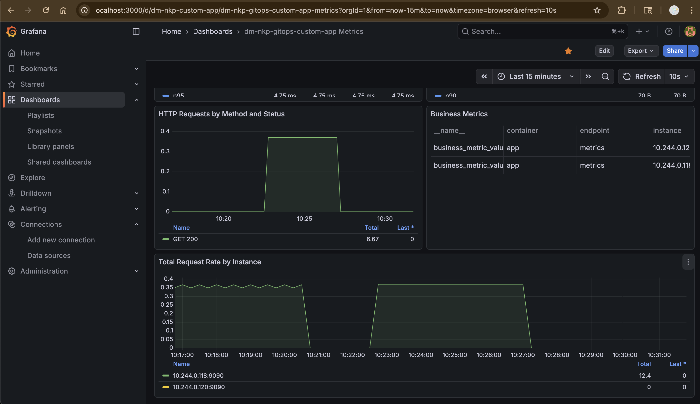
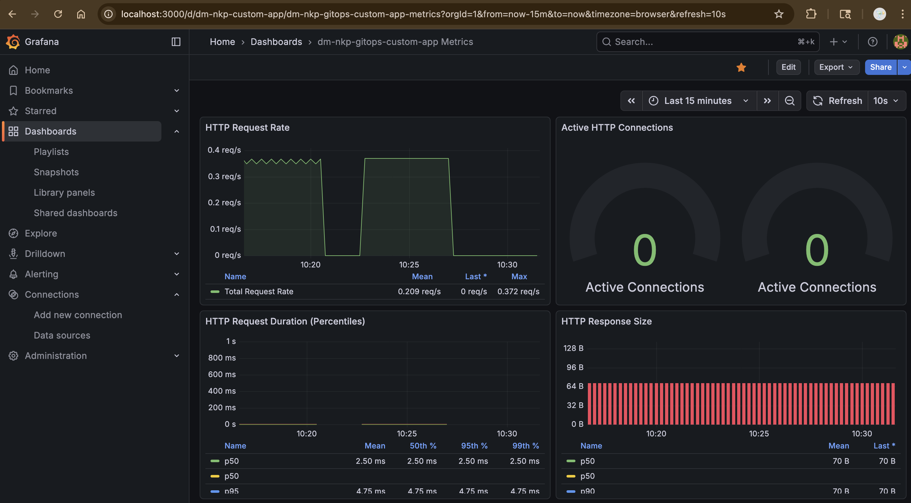

# dm-nkp-gitops-custom-app

[](https://github.com/deepak-muley/dm-nkp-gitops-custom-app/actions/workflows/ci.yml)
[](https://github.com/deepak-muley/dm-nkp-gitops-custom-app/actions/workflows/cd.yml)
[](https://github.com/deepak-muley/dm-nkp-gitops-custom-app/actions/workflows/security.yml)
[](https://scorecard.dev/viewer/?uri=github.com/deepak-muley/dm-nkp-gitops-custom-app)
[](LICENSE)
[](https://golang.org/)
[](https://kubernetes.io/)

A production-ready Golang application with OpenTelemetry telemetry (metrics, logs, traces), designed for deployment in Nutanix NKP (Nutanix Kubernetes Platform) infrastructure. This repository serves as a **reference implementation** for building cloud-native applications with comprehensive CI/CD, security scanning, and best practices.

## Overview

This is a demo application that demonstrates:

- OpenTelemetry telemetry export (metrics, logs, traces)
- Health and readiness endpoints
- Kubernetes deployment with Helm
- Integration with Traefik and Gateway API
- CI/CD with GitHub Actions
- Distroless container builds using buildpacks

## Core Application & Telemetry

### What the App Does

This is a simple HTTP server written in Go that serves three endpoints:

- **`/`** - Main endpoint that returns a JSON greeting message
- **`/health`** - Liveness probe endpoint for Kubernetes
- **`/ready`** - Readiness probe endpoint for Kubernetes

The server listens on port `8080` (configurable via `PORT` env var) and handles HTTP requests with timeouts and graceful shutdown support.

### How Telemetry is Generated

All telemetry is exported via **OpenTelemetry** to an OpenTelemetry Collector using the OTLP protocol (gRPC on port 4317). The collector then forwards data to:
- **Metrics** → Prometheus
- **Logs** → Loki  
- **Traces** → Tempo

#### Metrics

Metrics are **manually recorded** in the HTTP handlers using the `internal/metrics` package:

```go
// Example from server handlers:
metrics.IncrementRequestCounter()                          // Counter
metrics.IncrementRequestCounterVec(r.Method, "200")       // Counter with labels
metrics.UpdateActiveConnections(1)                        // Gauge
metrics.UpdateRequestDuration(duration)                   // Histogram
metrics.UpdateResponseSize(float64(len(responseBody)))    // Histogram
```

Available metrics:
- `http_requests_total` - Total HTTP request counter
- `http_requests_by_method_total` - Requests by method and status code
- `http_active_connections` - Current active connections gauge
- `http_request_duration_seconds` - Request duration histogram
- `http_response_size_bytes` - Response size histogram
- `business_metric_value` - Custom business metrics gauge

#### Logs

Logs are generated using **structured logging** via `internal/telemetry` package:

```go
// Example from server handlers:
telemetry.LogInfo(ctx, "Received request: method=GET path=/ remote_addr=127.0.0.1")
telemetry.LogError(ctx, "Failed to process request", err)
```

Logs are written to **stdout/stderr** and automatically collected by the OpenTelemetry Collector (configured to scrape container logs), which forwards them to Loki.

#### Traces

Traces are generated through **two mechanisms**:

1. **Automatic HTTP instrumentation** - The entire HTTP server is wrapped with OpenTelemetry HTTP middleware (`otelhttp.NewHandler`), which automatically creates spans for every HTTP request with:
   - HTTP method, URL, status code
   - Request/response sizes
   - Duration
   - Client IP and user agent

2. **Manual spans** - Additional spans are created in handlers for business logic:

```go
// Example from server handlers:
ctx, processSpan := tracer.Start(ctx, "process.request")
defer processSpan.End()

ctx, businessSpan := tracer.Start(ctx, "business.logic")
businessSpan.SetAttributes(attribute.String("business.operation", "generate_response"))
defer businessSpan.End()
```

All traces are automatically exported to the OpenTelemetry Collector via OTLP, which forwards them to Tempo.

### Quick Reference

**Generate Metrics/Logs/Traces:**
- Make HTTP requests to the server → Automatically generates all three types of telemetry
- Metrics: Manually recorded in handlers via `metrics.*` functions
- Logs: Written via `telemetry.LogInfo/LogError` functions (stdout/stderr)
- Traces: Auto-generated via `otelhttp` middleware + manual spans in handlers

**View Telemetry:**
- Metrics: Prometheus → Grafana
- Logs: Loki → Grafana  
- Traces: Tempo → Grafana

See [OpenTelemetry Quick Start](docs/OPENTELEMETRY_QUICK_START.md) for setup instructions.

## Features

- **OpenTelemetry Telemetry**: Unified metrics, logs, and traces via OTLP to OpenTelemetry Collector
- **Health Checks**: `/health` and `/ready` endpoints for Kubernetes probes
- **Multiple Metric Types**: Counter, Gauge, Histogram, and CounterVec examples
- **Helm Chart**: Production-ready Helm chart for Kubernetes deployment
- **Security Hardened**: Implements kubesec best practices with Seccomp, non-root user, read-only filesystem, and dropped capabilities (AppArmor disabled for kind compatibility)
- **Traefik Integration**: IngressRoute manifests for Traefik
- **Gateway API**: HTTPRoute manifests for Gateway API
- **CI/CD**: Automated testing and deployment via GitHub Actions
- **Security Scanning**: Kubesec integration for security validation
- **Distroless Images**: Secure, minimal container images using buildpacks

## Documentation

- **[Model Repository Template](docs/model-repository-template.md)** - Complete guide to replicating this repository setup
- **[CI/CD Pipeline](docs/cicd-pipeline.md)** - Complete CI/CD documentation
- **[GitHub Actions Reference](docs/github-actions-reference.md)** - All workflows documented
- **[Commit Signing Guide](docs/commit-signing.md)** - How to set up GPG commit signing for verified commits
- **[OpenSSF Scorecard](docs/openssf-scorecard.md)** - Security posture assessment
- **[Troubleshooting Guide](docs/TROUBLESHOOTING.md)** - Common issues and solutions
- **[Architecture Decision Records](docs/adr/)** - Technical decision documentation

## Project Structure

```
.
├── cmd/
│   └── app/
│       └── main.go              # Application entry point
├── internal/
│   ├── metrics/
│   │   ├── metrics.go          # Prometheus metrics definitions
│   │   └── metrics_test.go     # Unit tests for metrics
│   └── server/
│       ├── server.go           # HTTP server implementation
│       └── server_test.go      # Unit tests for server
├── tests/
│   └── tests/
│       ├── integration/
│       │   └── server_integration_test.go  # Integration tests
│       └── e2e/
│           └── e2e_test.go             # End-to-end tests
├── chart/
│   └── dm-nkp-gitops-custom-app/  # Helm chart
├── manifests/
│   ├── base/                   # Base Kubernetes manifests
│   ├── traefik/                # Traefik IngressRoute manifests
│   ├── gateway-api/            # Gateway API HTTPRoute manifests
│   └── monitoring/             # Prometheus and Grafana manifests
├── grafana/
│   └── dashboard.json          # Grafana dashboard for metrics visualization
├── .github/
│   └── workflows/              # GitHub Actions workflows
├── Makefile                    # Build automation
└── project.toml                # Buildpack configuration
```

## Quick Start

### Prerequisites

- Go 1.25 or later
- Make
- Docker (for container builds)
- kubectl (for Kubernetes deployment)
- Helm 3.x (for Helm chart operations)
- kind (for e2e tests, optional)

### End-to-End Demo with Grafana

To see the complete setup with metrics in Grafana dashboard:

```bash
# Run automated demo script
./scripts/run-e2e-demo.sh

# Then access Grafana (follow instructions at end of script)
kubectl port-forward -n monitoring svc/grafana 3000:3000
# Open http://localhost:3000 (admin/admin)
```

See [docs/E2E_DEMO.md](docs/E2E_DEMO.md) for detailed step-by-step instructions.

### Grafana Dashboard - End-to-End Verification

Once the application is deployed and running, you can verify the complete end-to-end setup by viewing the Grafana dashboard. The dashboard provides real-time visualization of application metrics, demonstrating that the entire monitoring stack is working correctly.

#### Dashboard Overview

The Grafana dashboard shows comprehensive metrics from the application, including HTTP request patterns, performance metrics, and instance-level breakdowns. Here are two screenshots demonstrating the dashboard in action:

**Dashboard View 1: Request Metrics and Performance**



This view shows:

- **Top Metrics Bar**: Key performance indicators including:
  - `n95`: 95th percentile response time (4.75 ms) - showing consistent low latency
  - `p90`: 90th percentile response size (70 B) - indicating stable response payloads
- **HTTP Requests by Method and Status**: Line graph showing GET 200 requests over time, with a sustained rate of ~0.35 requests/second during active periods
- **Business Metrics Table**: Displays custom business metrics with instance-level details
- **Total Request Rate by Instance**: Shows request distribution across multiple application instances (10.244.0.118 and 10.244.0.120), demonstrating load balancing and instance-level visibility

**Dashboard View 2: Comprehensive Metrics Overview**



This comprehensive view displays:

- **HTTP Request Rate**: Line graph showing requests per second (0-0.4 req/s range), with active periods showing consistent ~0.3 req/s traffic
- **Active HTTP Connections**: Gauge visualization showing zero active connections (indicating stateless request handling)
- **HTTP Request Duration (Percentiles)**:
  - p50 (median): 2.50 ms - half of requests complete in this time or faster
  - p95: 4.75 ms - 95% of requests complete within this duration
  - Both metrics show stable, flat lines indicating consistent performance
- **HTTP Response Size**: Bar chart showing stable response sizes around 64-70 bytes, with p50 and p90 percentiles both at 70 B

#### Understanding the Dashboard

**What These Metrics Tell You:**

1. **Request Rate Patterns**: The line graphs show when traffic is active vs. idle, helping you understand usage patterns and identify peak times.

2. **Performance Metrics**:
   - Low p50 and p95 values (2.5ms and 4.75ms) indicate excellent response times
   - Flat, stable lines mean consistent performance without spikes or degradation

3. **Instance Distribution**: Multiple instances (10.244.0.118, 10.244.0.120) show the application is running in a distributed setup, with requests being load-balanced across instances.

4. **Response Characteristics**:
   - Consistent response sizes (70 B) indicate predictable payloads
   - Zero active connections between requests shows efficient connection handling

5. **End-to-End Verification**: The presence of data across all panels confirms:
   - ✅ Application is running and serving requests
   - ✅ Prometheus is successfully scraping metrics
   - ✅ Grafana is querying Prometheus correctly
   - ✅ ServiceMonitor is configured properly
   - ✅ Metrics are being exported correctly from the application

**How to Access:**

```bash
# Port forward to Grafana
kubectl port-forward -n monitoring svc/grafana 3000:3000

# Open in browser
open http://localhost:3000
# Login: admin/admin

# Navigate to: Home > Dashboards > dm-nkp-gitops-custom-app Metrics
```

For more details on using and customizing the dashboard, see the [Grafana Dashboard Guide](docs/grafana.md).

### Local Development

1. **Clone the repository**:

   ```bash
   git clone https://github.com/deepak-muley/dm-nkp-gitops-custom-app.git
   cd dm-nkp-gitops-custom-app
   ```

2. **Install dependencies**:

   ```bash
   make deps
   ```

3. **Build the application**:

   ```bash
   make build
   ```

4. **Run the application**:

   ```bash
   ./bin/dm-nkp-gitops-custom-app
   ```

5. **Access the application**:
   - Main endpoint: <http://localhost:8080>
   - Health check: <http://localhost:8080/health>
   - Readiness check: <http://localhost:8080/ready>
   
   **Note**: Metrics are exported via OpenTelemetry to the OTel Collector (not exposed on a separate metrics port). See [Core Application & Telemetry](#core-application--telemetry) section above for details.

### Running Tests

```bash
# Run all unit tests
make unit-tests

# Run integration tests
make integration-tests

# Run e2e tests (requires kind)
make e2e-tests

# Run all tests
make test
```

## Makefile Targets

The Makefile provides the following targets:

- `help` - Show available targets
- `deps` - Download Go dependencies
- `fmt` - Format code
- `vet` - Run go vet
- `lint` - Run linters (fmt + vet)
- `build` - Build the application
- `test` - Run all tests
- `unit-tests` - Run unit tests
- `integration-tests` - Run integration tests
- `e2e-tests` - Run e2e tests
- `clean` - Clean build artifacts
- `helm-chart` - Package Helm chart
- `push-helm-chart` - Push Helm chart to OCI registry
- `docker-build` - Build Docker image using buildpacks
- `docker-push` - Build and push Docker image
- `all` - Run clean, deps, lint, build, test

## OpenTelemetry Metrics

The application exports the following OpenTelemetry metrics (forwarded to Prometheus by the OTel Collector):

- `http_requests_total` (Counter) - Total number of HTTP requests
- `http_active_connections` (Gauge) - Current number of active connections
- `http_request_duration_seconds` (Histogram) - Request duration distribution
- `http_response_size_bytes` (Histogram) - Response size distribution
- `http_requests_by_method_total` (CounterVec) - Requests by method and status
- `business_metric_value` (GaugeVec) - Custom business metrics

All metrics are exported via OTLP to the OpenTelemetry Collector (`otel-collector:4317`), which converts them to Prometheus format. When the collector's Prometheus exporter endpoint is scraped (port 8889), these metrics become available in Prometheus.

For more details, see [Core Application & Telemetry](#core-application--telemetry) section above.

## Deployment

### Using Helm Chart (Recommended)

1. **Package the Helm chart**:

   ```bash
   make helm-chart
   ```

2. **Install using Helm**:

   ```bash
   helm install dm-nkp-gitops-custom-app ./chart/dm-nkp-gitops-custom-app
   ```

3. **Push to OCI registry**:

   ```bash
   export GITHUB_TOKEN=your_token
   make push-helm-chart
   ```

### Setting Up Dependencies with Helm

#### Monitoring Stack (Prometheus + Grafana)

```bash
# Automated
make setup-monitoring-helm

# Or manually
./scripts/setup-monitoring-helm.sh
```

#### Configure Grafana Dashboard (Existing Clusters)

For existing clusters with Grafana already deployed:

```bash
# Auto-detect and configure everything
./scripts/setup-grafana-dashboard.sh

# Or specify custom settings
./scripts/setup-grafana-dashboard.sh [namespace] [grafana-service] [prometheus-url]
```

This script automatically:

- Configures Prometheus as datasource
- Imports the dashboard
- Works with any existing cluster setup

#### Traefik

```bash
# Automated
make setup-traefik-helm

# Or manually
./scripts/setup-traefik-helm.sh
```

#### Gateway API

```bash
# Automated
make setup-gateway-api-helm

# Or manually
./scripts/setup-gateway-api-helm.sh
```

### Using Kubernetes Manifests (Alternative)

1. **Deploy base resources**:

   ```bash
   kubectl apply -f manifests/base/
   ```

2. **Deploy Traefik IngressRoute** (if using Traefik):

   ```bash
   kubectl apply -f manifests/traefik/
   ```

3. **Deploy Gateway API HTTPRoute** (if using Gateway API):

   ```bash
   kubectl apply -f manifests/gateway-api/
   ```

**Note**: For monitoring, Prometheus, and Grafana, Helm charts are recommended over raw manifests. See [Helm Deployment Guide](docs/helm-deployment.md) for details.

### Using envsubst for Templating

For environment-specific deployments:

```bash
export APP_NAME=dm-nkp-gitops-custom-app
export NAMESPACE=default
export GATEWAY_NAME=traefik
export GATEWAY_NAMESPACE=traefik-system
export HOSTNAME=dm-nkp-gitops-custom-app.local
export HTTP_PORT=8080
export METRICS_PORT=9090

envsubst < manifests/gateway-api/httproute-template.yaml | kubectl apply -f -
```

## Container Build

### Using Buildpacks

Build a distroless container image:

```bash
# Install pack CLI first
# macOS: brew install buildpacks/tap/pack
# Linux: See https://buildpacks.io/docs/tools/pack/

make docker-build
```

### Push to Registry

```bash
export GITHUB_TOKEN=your_token
make docker-push
```

## CI/CD

The project includes GitHub Actions workflows:

- **CI Workflow** (`.github/workflows/ci.yml`):
  - Runs on push/PR to main/develop branches
  - Executes unit tests, integration tests, and e2e tests
  - Builds the application
  - Packages Helm chart

- **CD Workflow** (`.github/workflows/cd.yml`):
  - Runs on tags and main branch
  - Builds and pushes Docker image using buildpacks
  - Pushes Helm chart to OCI registry

## Integration with Nutanix NKP

This application is designed to integrate with Nutanix NKP infrastructure components:

- **OpenTelemetry Collector**: Receives all telemetry (metrics, logs, traces) via OTLP
- **Prometheus**: Metrics forwarded from OTel Collector (scraped via ServiceMonitor)
- **Grafana**: Dashboards visualize metrics, logs, and traces from all backends
- **Loki**: Application logs forwarded from OTel Collector
- **Tempo**: Distributed traces forwarded from OTel Collector
- **Traefik**: Ingress routing via IngressRoute
- **Gateway API**: Modern ingress via HTTPRoute
- **Dex**: Authentication/authorization (when integrated)

## Documentation

**📚 [Start Here: Documentation Guide](docs/README.md)** - Complete learning path organized by topics

### Quick Links

- **[Quick Start](docs/QUICK_START.md)** - Get up and running in 5 minutes
- **[Grafana Beginner Guide](docs/GRAFANA_BEGINNER_GUIDE.md)** - Understand dashboards and monitoring (⭐ Recommended)
- **[OpenTelemetry Quick Start](docs/OPENTELEMETRY_QUICK_START.md)** - Deploy observability stack
- **[Development Guide](docs/development.md)** - Local development setup
- **[Deployment Guide](docs/DEPLOYMENT_GUIDE.md)** - Production deployment
- **[E2E Quick Reference](docs/E2E_QUICK_REFERENCE.md)** - Run end-to-end tests
- **[Troubleshooting Guide](docs/TROUBLESHOOTING.md)** - Common issues and solutions

### Full Documentation Index

See **[Documentation Guide](docs/README.md)** for:
- 📖 Organized learning paths
- 🎯 Topic-based categories
- 🚀 Recommended reading order for beginners
- ⚠️ Deprecated/consolidated documents list
- 🎓 Step-by-step bootstrap guide

## Contributing

1. Fork the repository
2. Create a feature branch
3. Make your changes
4. Run tests: `make test`
5. Submit a pull request

## License

[Add your license here]

## Author

Deepak Muley
